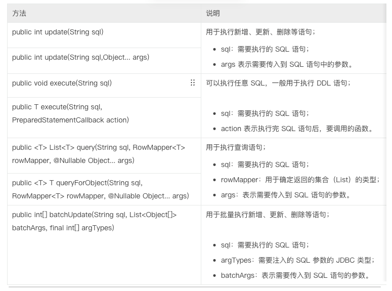

## 简介

JdbcTemplate 是 Spring JDBC 核心包（core）中的核心类，它可以通过配置文件、注解、Java 配置类等形式获取数据库的相关信息，实现了对 JDBC 开发过程中的驱动加载、连接的开启和关闭、SQL 语句的创建与执行、异常处理、事务处理、数据类型转换等操作的封装。我们只要对其传入 SQL 语句和必要的参数即可轻松进行 JDBC 编程。JdbcTemplate 的全限定命名为 org.springframework.jdbc.core.JdbcTemplate，它提供了大量的查询和更新数据库的方法，如下表所示。

## 什么是 JdbcTemplate

JDBC 作为 Java 访问数据库的 API 规范，统一了各种数据库的访问方式。但是，直接在 Java 程序中使用 JDBC 还是非常复杂和繁琐的。所以 Spring 对 JDBC 进行了更深层次的封装，而 JdbcTemplate 就是 Spring 提供的一个操作数据库的便捷工具。它主要是实现了数据库连接的管理，我们可以借助 JdbcTemplate 来执行所有数据库操作，例如插入、更新、删除和从数据库中检索数据，并且有效避免直接使用 JDBC 带来的烦琐编码。
Spring Boot 作为 Spring 的集大成者，自然会将 JdbcTemplate 集成进去。Spring Boot 针对 JDBC 的使用提供了对应的 Starter 包：spring-boot-starter-jdbc，它其实就是在 Spring JDBC 上做了进一步的封装，方便在 Spring Boot 项目中更好地使用 JDBC。
1、JdbcTemplate 的特点

- 速度快，相对于 ORM 框架，JDBC 的方式是最快的。
- 配置简单，Spring 封装的，除了数据库连接之外，几乎没有额外的配置。
- 使用方便，就像 DBUtils 工具类，只需注入 JdbcTemplate 对象即可。
  2、JdbcTemplate 的几种类型的方法
  JdbcTemplate 虽然简单，功能却非常强大。它提供了非常丰富、实用的方法，归纳起来主要有以下几种类型的方法：
  （1）execute 方法：可以用于执行任何 SQL 语句，一般用于执行 DDL 语句。
  （2）update、batchUpdate 方法：用于执行新增、修改与删除等语句。
  （3）query 和 queryForXXX 方法：用于执行查询相关的语句。
  （4）call 方法：用于执行数据库存储过程和函数相关的语句。
  总的来说，新增、删除与修改三种类型的操作主要使用 update 和 batchUpdate 方法来完成。query 和 queryForObject 方法中主要用来完成查询功能。execute 方法可以用来执行任意的 SQL、call 方法来调用存储过程。
