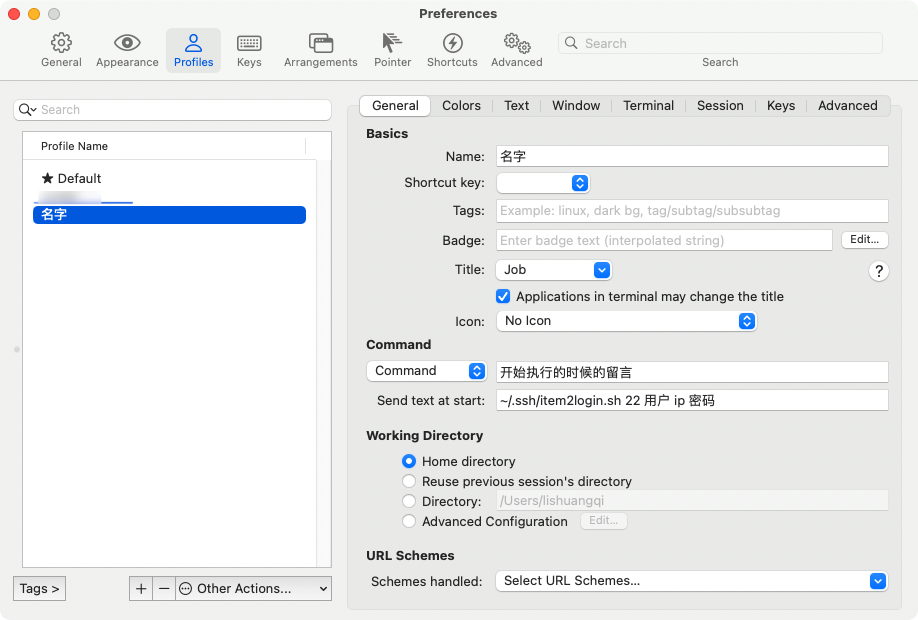

## 添加脚本

复制脚本到一个你喜欢的文件夹内，一般在.ssh文件夹内，保存为sh格式，我的名称为 `item2login.sh`

```shell
    set timeout 30
    spawn ssh -p [lindex $argv 0] [lindex $argv 1]@[lindex $argv 2]
    expect {
            "(yes/no)?"
            {send "yes\n";exp_continue}
            "password:"
            {send "[lindex $argv 3]\n"}
    }
    interact
```

## item2添加设置

点击Preferences -> Profiles -> 在左侧新加一个配置信息 -> 根据下方配置添加



如果你的脚本没放在.ssh目录下 ~/.ssh则替换为你的位置


```
~/.ssh/item2login.sh 22 用户 ip 密码
```
- 端口
- 用户名
- 服务器ip
- 密码

## 快捷键

配置完成后在item2界面，按 ‘common + o’ 即可