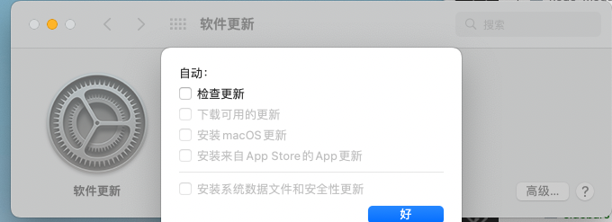
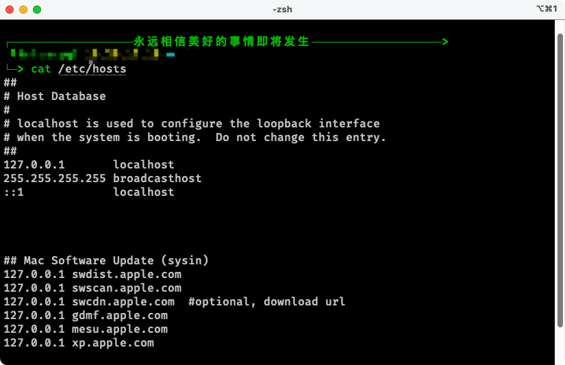
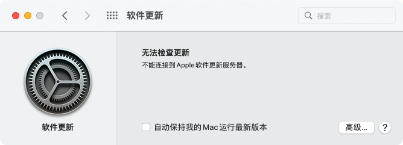

## 取消自动更新选项

请选取苹果菜单  >> “系统设置…” >> “通用”，然后点按 “软件更新”。
取消勾选：“自动更新” 中的相关项。



## 屏蔽网络访问
手动编辑：打开终端，执行命令 sudo vi /etc/hosts，添加以下条目：

```
## Mac Software Update (sysin)
127.0.0.1 swdist.apple.com
127.0.0.1 swscan.apple.com
127.0.0.1 swcdn.apple.com  #optional, download url
127.0.0.1 gdmf.apple.com
127.0.0.1 mesu.apple.com
127.0.0.1 xp.apple.com
```
加完的样子



## 临时清除系统更新标记
打开 “终端”，执行如下命令（可能需要重启才能生效）：
```
defaults delete com.apple.systempreferences AttentionPrefBundleIDs
defaults delete com.apple.systempreferences DidShowPrefBundleIDs
killall Dock
```

## 完成的样子


