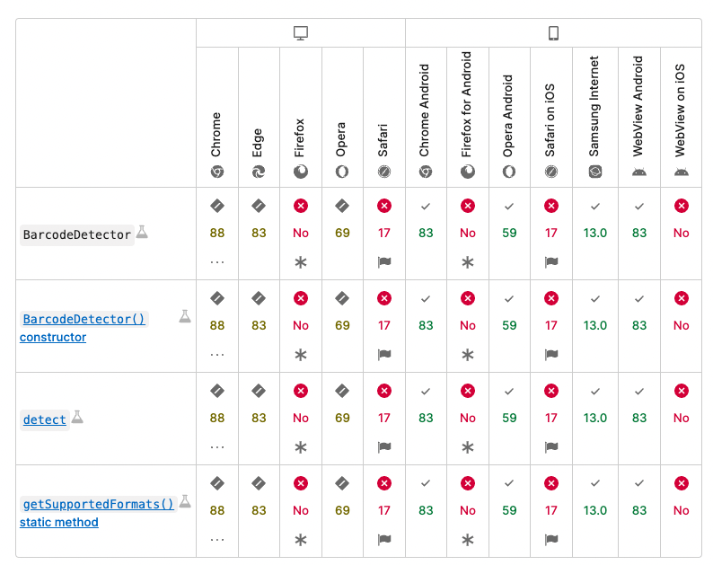

- `注意其中使用了实验性API` [BarcodeDetector](https://developer.mozilla.org/zh-CN/docs/Web/API/BarcodeDetector)


```js
   const getCamerasScan = async () => {
    try {
        // 请求摄像头权限
        const devices = await navigator.mediaDevices.enumerateDevices();
        const videoDevices = devices.filter(device => device.kind === 'videoinput');

        let selectedDeviceId;
        if (videoDevices.length > 1) {
            // 选择后置摄像头
            const backCamera = videoDevices.find(device => device.label.includes('back') || device.label.includes('环境'));
            if (backCamera) {
                selectedDeviceId = backCamera.deviceId;
            } else {
                // 如果没有找到后置摄像头，选择第一个摄像头
                selectedDeviceId = videoDevices[0].deviceId;
            }
        } else if (videoDevices.length === 1) {
            // 只有一个摄像头，直接选择
            selectedDeviceId = videoDevices[0].deviceId;
        }

        const constraints = {
            video: {
                deviceId: selectedDeviceId ? {exact: selectedDeviceId} : true,
                facingMode: 'environment'
            }
        };
        const stream = await navigator.mediaDevices.getUserMedia(constraints);
        const video = document.createElement('video');
        video.style.width = '250px'
        video.style.height = '250px'
        video.style.position = 'fixed'
        video.style.top = '25%'
        video.style.left = '20%'
        document.querySelector('#reader').appendChild(video)
        video.srcObject = stream;
        video.play();

        // 等待视频准备好
        await new Promise((resolve) => {
            video.oncanplay = resolve;
        });

        // 创建BarcodeDetector实例
        const detector = new BarcodeDetector({
            formats:
                ['aztec', 'code_128', 'code_39', 'code_93', 'codabar', 'data_matrix', 'ean_13', 'ean_8', 'itf',
                    'pdf417', 'qr_code', 'upc_a', 'upc_e', 'unknown']
        });

        // 开始循环扫描
        // eslint-disable-next-line no-inner-declarations
        async function scanLoop() {
            const canvas = document.createElement('canvas');
            const context = canvas.getContext('2d');
            canvas.width = video.videoWidth;
            canvas.height = video.videoHeight;

            // 需要验证扫描的图片时打开
            // document.querySelector('#reader').appendChild(canvas)

            // eslint-disable-next-line no-constant-condition
            while (true) {
                // 每秒拍摄一张照片
                await new Promise(resolve => setTimeout(resolve, 1000));
                context.drawImage(video, 0, 0, canvas.width, canvas.height);
                try {
                    // 确保图像已经绘制完成
                    await new Promise(resolve => requestAnimationFrame(resolve));

                    // 扫描条形码
                    const barcodes = await detector.detect(canvas);
                    if (barcodes.length > 0) {
                        console.log(barcodes[0].rawValue, '扫描出来的信息')
                        // 关闭摄像头
                        stream.getTracks().forEach(track => track.stop());
                        // 走自己的业务逻辑
                        break;
                    }
                } catch (error) {
                    console.error('扫描失败:', error);
                }
            }
        }

        scanLoop();
    } catch (error) {
        console.error('无法访问摄像头:', error);
    }
}
```