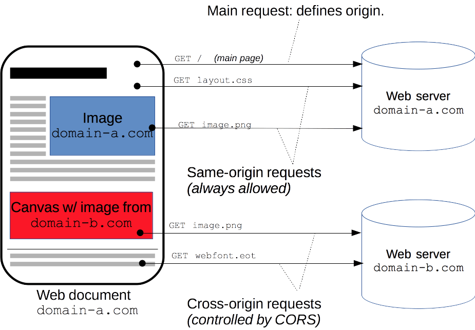
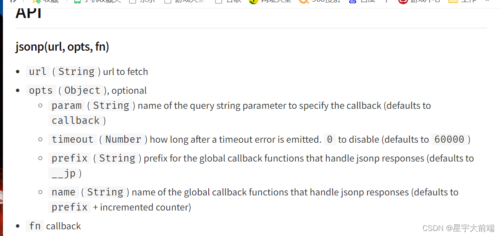
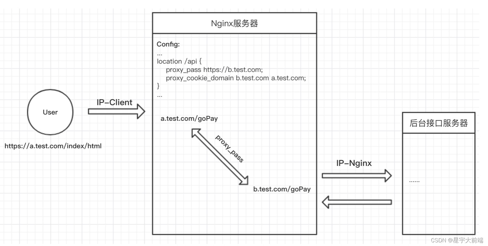

## 为什么会跨域

浏览器的同源策略，跨域也是因为浏览器这个机制引起的，这个机制的存在还是在于安全。

### 什么是源

`Web内容的源由用于访问它的URL 的方案(协议)，主机(域名)和端口定义。只有当方案，主机和端口都匹配时，两个对象具有相同的起源。`
同源不同源一句话就可以判断：就是 url 中 scheme host port 都相同即为同源。
下面认识下 url 结构中的这三个部分。

### URL 结构

`URL 代表着是统一资源定位符（Uniform Resource Locator）。URL 无非就是一个给定的独特资源在 Web 上的地址。`
URL 有如下结构组成：

- Schme 或者 Protocol

  

- Domain Name 也叫做 host 域名

  

- port 端口号

  

- Parameters 参数

  

- Anchor 锚点，一般用于定位位置

  

### 同源不同源的例子

- 同源例子
  - http://example.com/app1/index.html http://example.com/app2/index.html相同的scheme http 和 host
  - http://Example.com:80 http://example.comhttp 默认 80 端口所以同源
- 不同源例子
  - http://example.com/app1 https://example.com/app2不同的协议
  - http://example.com http://myapp.example.com不同的host
  - http://example.com http://example.com:8080不同的端口

### 浏览器为什么需要同源策略

同源策略是一个重要的安全策略，它用于限制一个 origin 的文档或者它加载的脚本如何能与另一个源的资源进行交互。它能帮助阻隔恶意文档，减少可能被攻击的媒介。


## 前端解决方案

在没有前后端分离的时候，跨域问题往往是很少的。因为前后端都部署到一起。现在前后端分离不管 vue /react 面临跨域请求的问题。
下面是引用官网描述的一张图来解释跨域：



跨源域资源共享（CORS）机制允许 Web 应用服务器进行跨源访问控制，从而使跨源数据传输得以安全进行。现代浏览器支持在 API 容器中（例如 XMLHttpRequest 或 Fetch）使用 CORS，以降低跨源 HTTP 请求所带来的风险。

### jsonp

JSONP 的原理非常简单，就是 HTML 标签中，很多带 src 属性的标签都可以跨域请求内容，比如我们熟悉的 img 图片标签。同理，script 标签也可以，可以利用 script 标签来执行跨域的 javascript 代码。通过这些代码，我们就能实现前端跨域请求数据。
jsonp 可以在前端解决跨域问题，但是只是针对于 get 请求。实现方式可以引用一些 npm 第三方库实现，jquery 也是带的。
可以在 npm 搜下 jsonp 库实现，非常简单。



### webpack-dev-server

前端无论是 vue 项目还是 react 项目大多数都会以 webpack-dev-server 来运行，webpack-dev-server 可以设置代理，前端可以在开发环境设置代理解决跨域问题。

```js
 proxy: {
      '/api': {
        target: 'http://localhost:3000',
        pathRewrite: { '^/api': '' },
        changeOrigin: true,
      },
   }
```

### document.domain

利用 document.domain 可以修改 访问页面的域，多用在父子关系的域，子域可以设置 document.domain 等于父域，从而解决同父域跨域问题。
举例子：
www.ios.xingyu.com 访问 www.web.xingyu.com 跨域，可以利用 document.domain 设置成 www.xingyu.com

## 后端解决方案
后端框架也很多，实现原理差不多，都是修改下相应头。以常用的Java SpringCloud 和nodejs koa 框架为例。
### Http 协议CORS头
跨域其实也是http层面上可以解决的问题，后端解决也是比较简单的，也是项目常见的解决手法。
CORS （Cross-Origin Resource Sharing，跨域资源共享）是一个系统，它由一系列传输的HTTP头组成，这些HTTP头决定浏览器是否阻止前端 JavaScript 代码获取跨域请求的响应。
同源安全策略 默认阻止“跨域”获取资源。但是 CORS 给了web服务器这样的权限，即服务器可以选择，允许跨域请求访问到它们的资源。
- Access-Control-Allow-Origin
 指示请求的资源能共享给哪些域。
- Access-Control-Allow-Credentials
 指示当请求的凭证标记为 true 时，是否响应该请求。
- Access-Control-Allow-Headers
 用在对预请求的响应中，指示实际的请求中可以使用哪些 HTTP 头。
- Access-Control-Allow-Methods
 指定对预请求的响应中，哪些 HTTP 方法允许访问请求的资源。
- Access-Control-Expose-Headers
 指示哪些 HTTP 头的名称能在响应中列出。
- Access-Control-Max-Age
 指示预请求的结果能被缓存多久。
- Access-Control-Request-Headers
 用于发起一个预请求，告知服务器正式请求会使用那些 HTTP 头。
- Access-Control-Request-Method
 用于发起一个预请求，告知服务器正式请求会使用哪一种 HTTP 请求方法。
- Origin
 指示获取资源的请求是从什么域发起的。
### SpringCloud设置跨域
在跨域过滤器里配置一下跨域头部，* 是通配符即允许所有。
```java
@Configuration
public class GatewayCorsConfiguation {
 
    @Bean
    public CorsFilter corsFilter(){
        // 初始化cors配置对象
        CorsConfiguration configuration = new CorsConfiguration();
        configuration.setAllowCredentials(true); // 允许使用cookie，但是使用cookie是addAllowedOrigin必须是具体的地址，不能是*
//        configuration.addAllowedOrigin("*");
        configuration.addAllowedOrigin("http://manage.leyou.com");
        configuration.addAllowedMethod("*");  //允许的请求方式,get,put,post,delete
        configuration.addAllowedHeader("*");//允许的头信息
 
        //初始化cors的源对象配置
        UrlBasedCorsConfigurationSource corsConfigurationSource = new UrlBasedCorsConfigurationSource();
        corsConfigurationSource.registerCorsConfiguration("/**",configuration);
 
        //3.返回新的CorsFilter.
        return new CorsFilter(corsConfigurationSource);
    }
}
```
### SpringBoot配置
```java
/**
 * 跨域配置
 */
@Configuration
public class CorsConfig implements WebMvcConfigurer {

   /**
    * 跨域注册器
    *
    * @param registry 跨域注册器
    */
   @Override
   public void addCorsMappings(CorsRegistry registry) {
       
      // 设置允许跨域的路径
      registry.addMapping("/**")
            // 设置允许跨域请求的域名
            .allowedOrigins("*")
            // 是否允许证书 不再默认开启
            .allowCredentials(true)
            // 设置允许的方法
            .allowedMethods("*")
            // 设置允许的头
            .allowedHeaders("*")
            // 跨域允许时间
            .maxAge(3600);
   }
}

```
## 运维解决方案
ngnix举例，其他web 服务器就不说了，原理同webpack-dev-server 设置代理转发解决跨域问题。
步骤：
- 前端和运维商量好协议路径代理规则，比如/api 代表域名
- 前端配置webpack -dev -server 代理
- 服务器利用ngnix 配置相同转发代理
ngnix 配置代理解决跨域配置：
```
location /api {
   proxy_pass https://b.test.com; # 设置代理服务器的协议和地址
} 
```
