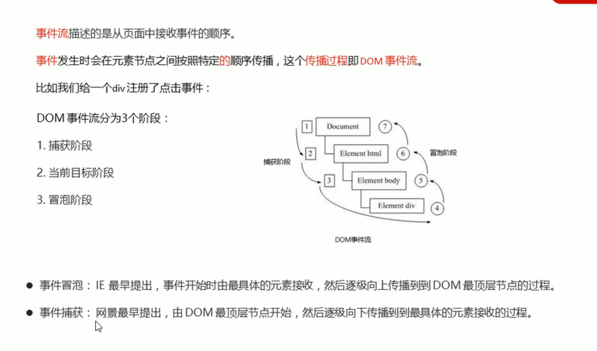
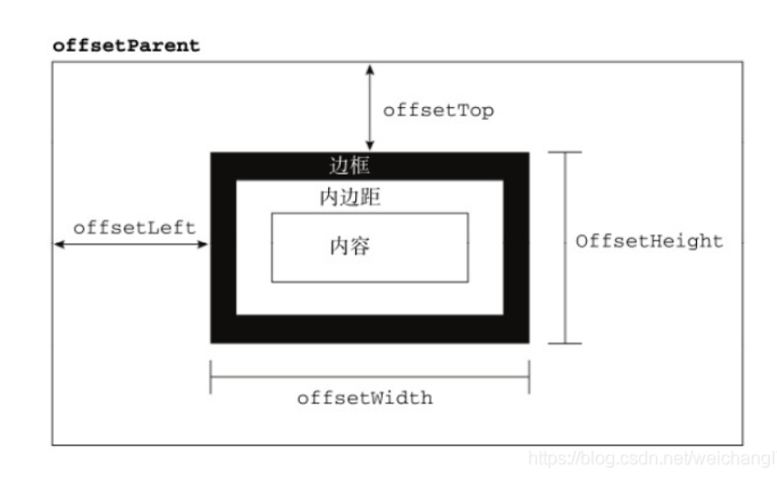

---
title: 常用DOM,BOM
category:
  - api
tag:
  - dom
  - bom
---

JS常用DOM,BOM

## DOM

ES5 通过选择器获取————document.querySelector(' ') / document.querySelectorAll(' ')

括号内可以用选择器样式,除了hover类似的伪类都可以 例如 document.querySelector(' ul>li')

元素样式———— .classList.add(' ') .classList.remove(' ') || .className = ' ' || .style

标签内添加内容———— .innerHTML = ' <> <>'

节点操作————

获取**节点**子级 父级————  **.children**  **.parentNode**

document.createElement("XXX")——**创建元素节点**

document.createTextNode('XXX') ——创建文本节点  **可用.innerHTML直接添加**

.insertBefore(新内容, 位置[第几个])——**插入节点**  （后） 第几个开始添加节点 [第几个]  **.appendChild**（下） .lastElementchild .firstElementchild

.removeChild(位置[第几个]])——**删除子元素**

.remove()——**删除自己**

replaceChild(元素, 位置[第几个])——**修改元素**

cloneNode( )——**克隆**（浅拷贝 只是复制标签不复制内容） 括号内（true）为**深度克隆**

获取元素style样式————

let eleWidth = getComputedStyle(ele)['width'] // getComputedStyle(要获取的元素)['要获取的属性']

let eleHeight = getComputedStyle(ele)['height']

操作自定义属性

获取 .getAttribute('属性')

添加 .setgetAttribute('属性名,值')

删除 .removegetAttribute('属性名')

获取宽高

盒子模型大小

var w = XXX.offsetWidth

var h = XXX.offsetHeight

元素可视区大小

var w = XXX.clientWidth

var h = XXX.clientHeight

获取超出内容大小

var w = XXX.scrollWidth

var h = XXX.scrollHeight

元素位置

定位父级距离

console.log(XXX.offsetLeft)

console.log(XXX.offsetTop)

浏览器距离

console.log(XXX.getBoundingClientRect().left)

console.log(XXX.getBoundingClientRect().top)

鼠标距离  **（事件对象演示）**

oDiv.onclick = function (ev) { //\*\*ev是形参 表示事件时 ， ev代表事件对象 其中包含很多方法具体可log一下查看要使用的属性进行获取\*\*

鼠标到浏览器的距离

console.log(ev.pageX, ev.pageY)

鼠标到元素的距离

console.log(ev.offsetX, ev.offsetY)

鼠标到可视区距离

console.log(ev.clientX, ev.clientY)

}

阻止浏览器**默认行为**————ev.preventDefault() //ev是形参 表示事件时

键盘码————.keyCode 特殊按键 shiftKey altKey ctrlKey

事件源————ev.srcElement 返回事件的源头 例如点击事件返回你点击的东西

事件委托  ————ev.target.tagName

.target 目标 .tagName 目标名字

被创建的元素加事件必须要使用事件委托

用于判断时候 ev.target.tagName === 'LI' // '大写'

事件冒泡 ————标签嵌套，事件相同，就会产生事件冒泡

ev.cancelBubble = true 阻止事件冒泡

事件绑定（方法监听）———— .addEventListener （新）.attachEvent('事件', function () { alert( )} ) 可以有第三个参数  //true捕获 false冒泡

同一个按钮的事件 传统方式后面会把前面的覆盖导致只出现一个样式。一个按钮实现多个方式用事件绑定

var oBtn = document.querySelector('.btn')

oBtn.onclick = function () {

alert('1')

}

oBtn.addEventListener('click', function () {

alert(2)

} ， //true捕获 false冒泡)

oBtn.addEventListener('click', function () {

alert(3)

})

解除绑定———— .removeEventListener(事件, 函数名, boolean) （新）.detachEvent(type, fn)

oBtn.addEventListener('click', fn)

function fn() {

alert(1)

}

oBtn.removeEventListener('click',fn)

## BOM

一般 window 可以省略

location.href————获取**地址栏**信息

location.href = '[http://www.jd.com](http://www.jd.com/)'（这样添加网页不会被拦截）

.onscroll————页面**滚动**事件

document.documentElement.scrollTop || document.body.scrollTop 滚动距离

window.innerWidth / window.innerHeight————**获取页面大小（包含滚动条）**

document.documentElement.clientWidth / document.documentElement.clientHeight———— 不包含滚动条

定时器

setInterval(fn, ms)一直执行—————clearInterval（清除）

setTimeout(fn, ms) 执行一次——————clearTimeout

fn为函数

## 其它

严格模式 ———— 'use strict'

字符串操作

indexOf - lastIndexOf————**查找**：返回下标，查找不到返回-1

.slice(2, 4)————开始位置**切**到结束（2到4）

.replace('l', '\*')————**替换**  （i 变 \*）

.split('e')————**字符串转数组**（e为分割条件）

.join('&')————**数组转字符串**（&为条件 可空）

## js补充

明知道后期不会重新赋值的的量，尽量使用const设置

只能设置常量，必须有初始值没有会报错，

完成一行后尽量写分号；

下面的例子都是以字符串 a 表示

字符串拼接的第二种方式 console.log(``my name is{name} and i**nameandi**{age}

其中${ }内写变量 可以代替 +

属性没有括号 方法才有（方法是一个函数对象） !!!

.forEach（funcation（a , b））循环中 a ， b都是形参。可以不是ele，index---

对象与JSON很像，可以进行转换，JSON内没有单引号，有就报错，JSON为往服务器内发送的数据，对象不是。

转换方式：

const zljson = JSON.stringify(zl);

console.log(zljson); //zl为对象名称 const声明新的常量

新的函数声明方式

新变量名 = （形参1 ， 形参2 ---） => {条件}；{}可以省略

var a = (n , m) => n + m;  这样写n+m就是返回值，写上return会报错

var a = (n , m) =>{  这样加{}写需要写return，否则undefinedreturn n + m

};

引用时console.log(a(1 , 1));

---------------------------------------------------------------分割线-----------------------------------------------------------------

## 用的少

some————有一个满足条件就返回true

every————全满足条件才返回true

var res = arr.some(function (ele, index, arr) {

return ele > 100

})

**BOM**

浏览器和系统信息

navigator.userAgent

var agent = navigator.userAgent

if (agent.indexOf('Android') !== -1) {

alert('Android')

} else {

alert('IOS')

}

console.log(agent)

版本————var appVersion = navigator.appVersion

window.prompt————输入框

window.confirm('是否删除？') ———— 问询框

history————浏览器历史

