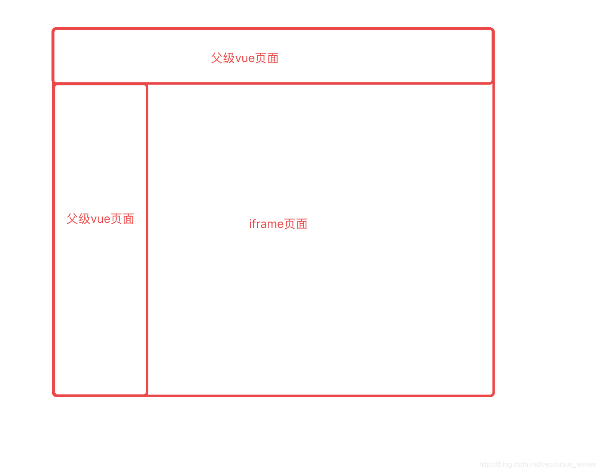
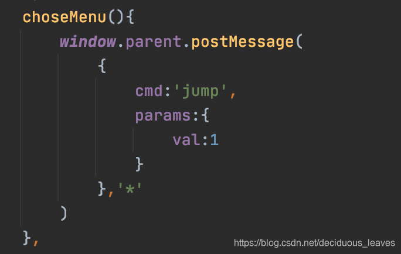
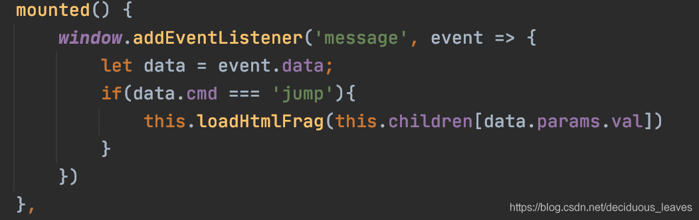
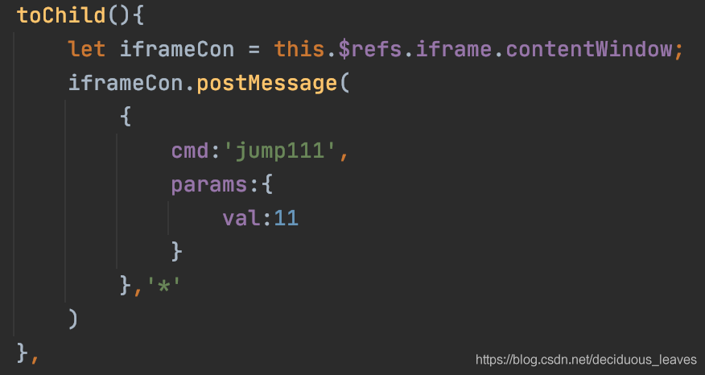
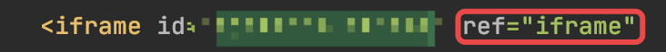
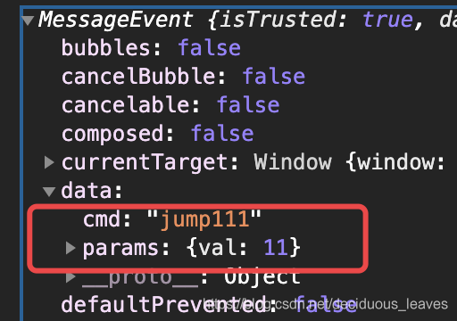
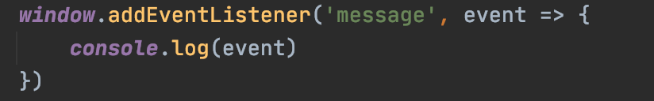

使用背景，前端采用html单页面引用vue的方式


页面大致是这样，现在需要做的是在iframe页面里面触发事件跳转页面，并且使父级vue页面的左侧菜单选中相应页面的菜单，当然iframe子页面也是vue，但是其他页面也不影响

## 一、子页面向父页面传值

1、在iframe页面里触发事件，找到他的父级页面的dom元素，用postMessage传值，里面所有的都是参数，cmd是为了能在父级vue页面区分该操作的用途



2、在父级vue页面的周期函数mounted中监听iframe中发来的消息，传来的参数就在event.data里面。（loadHtmlFrag()
则是在父级vue页面methods中的方法）



## 二、父页面向子页面传值

会了子页面向父业面传值，那父页面向子页面传值也就会了，就是吧一二步骤调换未知

1、在父页面中触发事件传递参数，在父页面通过ref来得到iframe子页面的dom元素，然手使用postMessage传参。



`通过ref获取dom，父页面的iframe标签里写ref就行`


2、和上面一样，在子页面的周期函数mounted中监听父页面发来的消息




## 补充

为了确保ifame可以在加载完成后触发父给子的函数, 应在子内在给父发送,在父接受参数中触发

### 父

#### 接收

```vue
mounted() {
    window.addEventListener(
        "message",
        (e) => {
        if (e.data.type == "over") {
        
        }},
        false
    );
},
```

#### 发送
```js
this.$refs.Ifame.contentWindow.postMessage(
{
type: "Search",
con: {

            },
          },
          "*"
    );

```
### 子

#### 发送

```vue
mounted() {
    window.top.postMessage(
        {
        type: "over",
        },
    "*"
);
```

#### 接收

```js
window.addEventListener(
"message",
(e) => {
if (e.data.type == "Search") {

        }
      },
      false
    );

}
```
