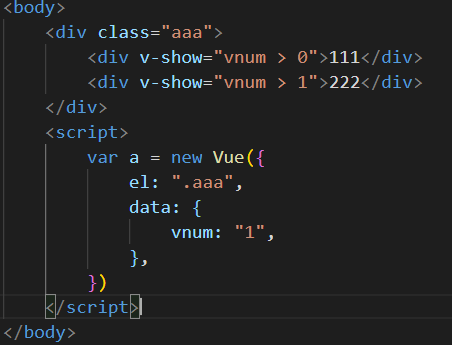

# Vue实例
```js
var app = new Vue({
  el:'#app',
  data:{
    message:'hello world'
  }
})
```
## el 挂载点
- el后可以使用其它选择器，建议使用id选择器
- 只能支持双标签html，body除外（因为单标签的内部无法写{{message}}   ），建议挂载div 因为div没有基础的样式   ，p，h2等会有自己本身的样式
- 其中Message对外部是没用的，在el元素命中的内部才可以使用
- new Vue   （V是大写的）
- 给一个父元素设置挂载点 下面的元素都可以直接使用
## data数据对象
- 当data中复杂类型时   遵守js的语法
## methods 方法
- methods内写绑定的方法
- 方法中通过this关键字   获取data中的数据
## Vue指令
### v-text
- 设置元素文本   简写为 {{   }}
```js
    <div>{{message}}</div>
```
- 覆盖，会顶掉元素内之前写的内容
- 后面可以进行字符串拼接，但是由于两边已经是双引号了，所以另外添加的需要是单引号
- {{message}}添加不会清除原来的内容，   {{message}}同样支持字符串拼接
### v-html
innerHTML
- 写法与v-text相同，效果与innerHTML相同
### v-on
为元素绑定事件       简写为 @
```html
    <div @click="show">{{message}}</div>
    <div v-on:click="show">{{message}}</div>
```

- v-on：与 @ 效果相同
- methods内写绑定的方法
- 事件不加on与js语法(onclick)相同（on已经在v-on添加完了）
- 事件绑定的方法写成函数调用的方式     xxx（）
- 定义方法时 定义形参接收传入的实参
- @keyup.enter 事件修饰符（.修饰符），限制按键是enter才会执行
### v-show
`根据表达值的布尔值真假，切换元素显示和隐藏操控样式`
- 原理为     display：none

- 上图中 第一个div满足条件显示 第二个不满足条件不显示
- v-show后面的判断条件是最后被解析成 布尔值
- 配合v-on等指令更换data中的数值实现灵活控制时候显示（案例） 
#### 案例：
- 点击按钮切换显示状态 通过方法更改显示状态

### v-if
`根据表达值的布尔值真假，切换元素显示和隐藏`
- 与v-show不同 直接操控dom     
- 使用方法一致
- 元素直接在文档中出现消失
- 注意：在使用中 频繁切换的元素用v-show反之v-if
### v-bind
设置元素的属性（例如src class等 都是行内的）   简写为v-bind可以省略
```html
<!--第一种和第二种效果一致    -->


```
- 后可以写三元表达式

### v-for
`根据数据生成列表结构`
例如：当数组中有4个值的时候，就会给你生成4个（如下图中 会生成4个li）
```html
<li v-for="(item,index) in arr" :key="item">{{item}}{{index}}</li>
<script>
    var app = new Vue({
      el:'#app',
      data:{
        arr:["1","2","3","4"]
      }
    })
</script>
```
- v-for后 （it，index）in arr   。
- 遍历arr这个数组，其中it是数组的每个值     index是数组的下标
- 当遍历的类型时数组对象时，遍历出来的每个对象在使用处用   .xxx 得到获取的对象的值??????????
- data中的数组对象可以在方法中进行数组对象操作（push shift。。。）
### v-model
`获取和设置表单元素的值（双向数据绑定）`
```html
<input type="text" v-model="message" />
<script>
    var app = new Vue({
      el:'#app',
      data:{
        message:"hello world"
      }
    })
</script>
```
- 更改两边的任意一边 另一个都会随着更改
- 绑定的数据和表单元素值相互关联
- 更改后值确实在同步更新 但是不会体现在代码里面 可以在设置个{{ xxx }}进行查看
- 注意：v-model应用在表单元素上,可以应用在组件上
- v-model的原理是：v-bind:value  v-on:input
- v-model:value  v-on:input  简写为  v-model
